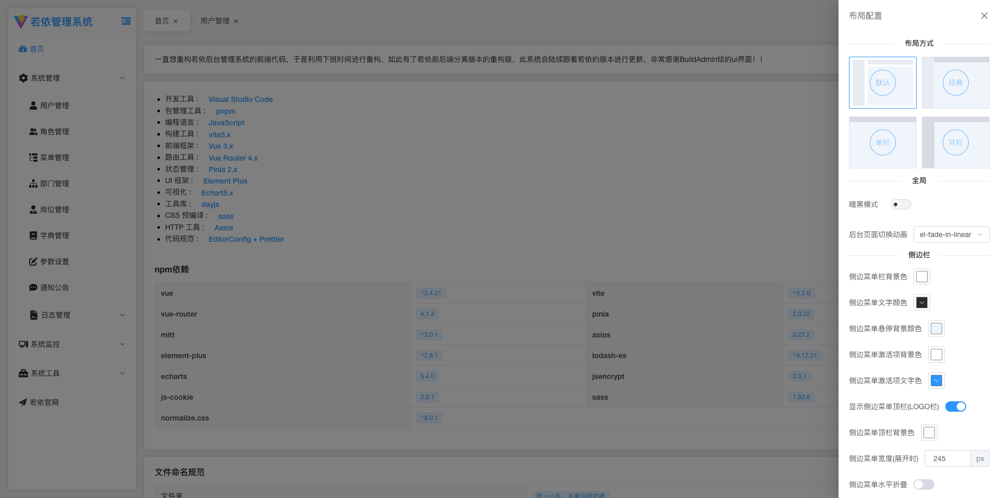
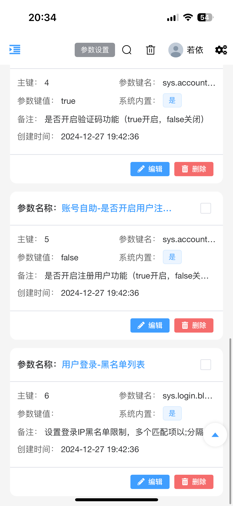

# 若依前后端分离-js版本-前端

## 项目介绍

1. 本项目可以完美的对接原版本的ruoyi前后端分离版本的后端

2. 本项目重构了若依前后端分离版本的前端70%的代码，代码高度内聚，并优化了界面的ui。

3. 提供了技术栈<a href="https://gitee.com/codelm/ruoyi-vue3-lmw-ts">vue3+ts</a> 版本，保持同步更新。

## 技术选型

- 开发语言：JavaScript
- 基础框架：Vue3.5.x
- 构建工具：Vite
- 组件库：Element-Plus
- 包管理器：pnpm
- ...

## Node版本

- Node20.10.0以上

## 前端运行

```bash
# 克隆项目
git clone https://gitee.com/codelm/ruoyi-vue3-lmw.git

# 进入项目目录
cd ruoyi-vue3-lmw

# 安装依赖
pnpm install

# 启动服务
pnpm dev

# 打包项目
pnpm build:prod

```

## 演示图

<table>
  <tr>
    <td></td>
    <td></td>
  </tr>
  <tr>
    <td></td>
    <td></td>
  </tr>
  <tr>
    <td></td>
    <td></td>
  </tr>
  <tr>
    <td></td>
    <td></td>
  </tr>
  <tr>
    <td></td>
    <td></td>
  </tr>
  <tr>
    <td></td>
    <td></td>
  </tr>
  <tr>
    <td></td>
    <td></td>
  </tr>
  <tr>
    <td></td>
    <td></td>
  </tr>
  <tr>
    <td></td>
    <td></td>
  </tr>
    <td></td>
    <td></td>
  </tr>
    </tr>
    <td></td>
    <td></td>
  </tr>
  </tr>
    <td></td>
    <td></td>
  </tr>
  </tr>
    <td></td>
    <td></td>
  </tr>
  </tr>
    <td></td>
    <td></td>
  </tr>
  </tr>
    <td></td>
    <td></td>
  </tr>
</table>

## 联系本人

本人微信：lmwcoder ，欢迎大家加入群聊提供建议，
无需捐赠，如果觉得项目不错，或者已经在使用了，希望你可以去帮我点个 ⭐ Star。

## 目录结构

```tree
├── BaseComponent				//脱离所有业务的组件
├── api									//网络请求
├── assets							//静态资源
├── components					//全局业务组件
├── directive						//全局指令
├── hooks								//hooks
├── layout							//布局
├── plugins							//通用方法
├── router							//路由
├── store								//全局 store管理
├── utils								//全局公用方法
├── views								//所有页面
├── App.vue             // 入口页面
└── main.js             // 入口 加载组件 初始化等
```

## 前端页面生成模板

参考本项目中的ruoyi-generator文件夹

## 组件使用说明

### 1、BaseForm

#### 属性

| 属性名       | 说明                                                                                                                                           | 类型         | 默认值                                                                                    |
| ------------ | ---------------------------------------------------------------------------------------------------------------------------------------------- | ------------ | ----------------------------------------------------------------------------------------- |
| elFormConfig | element-plus的Form组件参数                                                                                                                     | `Object`     | {}                                                                                        |
| allDisabled  | 是否禁用所有操作框                                                                                                                             | `boolean`    | false                                                                                     |
| formItems    | 需要渲染的form项，具体参考下方的formItem                                                                                                       | `Array`      | []                                                                                        |
| data         | 表单数据                                                                                                                                       | `Object`     | 必填                                                                                      |
| itemStyle    | 每个formItem的样式                                                                                                                             | `Object`     | { padding: '0px 20px 0px 0px' }                                                           |
| colLayout    | 单个formItem布局配置，参考element-plus的<a href="https://element-plus.org/zh-CN/component/layout.html#col-api">Layout组件</a>                  | `Object`     |                                                                                           |
| footerLayout | footer插槽的布局配置，参数同上                                                                                                                 | `Object`     | { xl: 3, //1920<br/>lg: 4, //1200<br/>md: 6, //992<br/>sm: 12, //768<br/>xs: 24, //<768 } |
| rowConfig    | 所有formItem的布局配置，参考element-plus的Layout组件中<a href="https://element-plus.org/zh-CN/component/layout.html#row-api">el-row的配置</a>  | `Object`     | {}                                                                                        |
| rules        | 表单正则校验，参考element-plus的<a href="https://element-plus.org/zh-CN/component/form.html#%E8%A1%A8%E5%8D%95%E6%A0%A1%E9%AA%8C">表单校验</a> | `Object`     | {}                                                                                        |
| hideItems    | 需要隐藏的列(需要用ref包裹)                                                                                                                    | `ref(Array)` | []                                                                                        |

##### formItem

| 属性名         | 说明                                                                                                         | 类型      | 默认值 |
| -------------- | ------------------------------------------------------------------------------------------------------------ | --------- | ------ |
| field          | data的键名                                                                                                   | `String`  | —      |
| isHidden       | 是否隐藏该列                                                                                                 | `Boolean` | false  |
| hideLabel      | 是否隐藏label                                                                                                | `Boolean` | false  |
| label          | 标签文本                                                                                                     | `String`  | —      |
| formItemConfig | 参考element-plus的<a href="https://element-plus.org/zh-CN/component/form.html#formitem-api">formItem</a>配置 | `Object`  | —      |
| type           | 参考下方的type                                                                                               | `String`  | —      |
| config         | 根据type的选择配置不同的config，可以根据type的类型去查看element-plus的文档                                   | `Object`  | —      |
| eventFunction  | 组件的监听事件，根据type的类型去查看element-plus的文档                                                       | `Object`  | —      |
| slotNames      | 根据type类型去查看对应element-plus组件的插槽配置，对外暴露的插槽名称为field+驼峰的slotName                   | `Array`   |        |

##### type

| 属性名称    | 说明                                                                                                                             |
| ----------- | -------------------------------------------------------------------------------------------------------------------------------- |
| input       | 参考element-plus的<a href="https://element-plus.org/zh-CN/component/input.html">input</a>，下面所有的type都可参考element-plus    |
| password    | <a href="https://element-plus.org/zh-CN/component/input.html">input</a>                                                          |
| inputNumber | <a href="https://element-plus.org/zh-CN/component/input-number.html">input</a>                                                   |
| textarea    | <a href="https://element-plus.org/zh-CN/component/input.html#%E6%96%87%E6%9C%AC%E5%9F%9F">Input</a>                              |
| cascader    | <a href="https://element-plus.org/zh-CN/component/cascader.html">cascader</a>                                                    |
| select      | <a href="https://element-plus.org/zh-CN/component/select.html">select</a>                                                        |
| tree        | <a href="https://element-plus.org/zh-CN/component/tree.html">Tree</a>                                                            |
| treeSelect  | <a href="https://element-plus.org/zh-CN/component/tree-select.html">TreeSelect</a>                                               |
| datepicker  | <a href="https://element-plus.org/zh-CN/component/date-picker.html">DatePicker</a>                                               |
| checkBox    | checkbox组件，具体使用可以查看BaseForm的源代码，很容易看懂，路径：`src/BaseComponent/BaseForm/src/cpn/src/CheckBox/CheckBox.vue` |
| radio       | radio，具体使用可以查看BaseForm的源代码，很容易看懂，路径：`src/BaseComponent/BaseForm/src/cpn/src/Radio/Radio.vue`              |
| custom      | 自定义类型，当type='custom'时会向外部暴露一个插槽，插槽名称为field+Custom                                                        |

#### 插槽

| 插槽名            | 说明                                                  |
| ----------------- | ----------------------------------------------------- |
| field+CustomLabel | 自定义label 例如label上还需要加按钮可能就需要这个插槽 |
| field+Before      | 每个formItem的前置插槽                                |
| field+After       | 每个formItem的后置插槽                                |
| footer            | 最尾部的插槽                                          |

### 2、BaseTable

#### 属性

| 属性名           | 说明                                                                                                                                             | 类型             | 默认值                                    |
| ---------------- | ------------------------------------------------------------------------------------------------------------------------------------------------ | ---------------- | ----------------------------------------- |
| dataList         | 表数据                                                                                                                                           | `Array`          | []                                        |
| tableItem        | 参考下方的tableItem                                                                                                                              | `Array`          | []                                        |
| tableListener    | table的监听事件参考element-plus的 <a href="https://element-plus.org/zh-CN/component/table.html#table-%E4%BA%8B%E4%BB%B6">table组件的监听事件</a> | `Object`         | {}                                        |
| showChoose       | 是否展示复选框                                                                                                                                   | `Boolean`        | false                                     |
| showIndex        | 是否展示序号                                                                                                                                     | `Boolean`        | false                                     |
| pagination       | 是否显示分页                                                                                                                                     | `Boolean`        | true                                      |
| listCount        | 总条数                                                                                                                                           | `Number`         | 0                                         |
| paginationInfo   | 分页的页码和偏移                                                                                                                                 | `Object`         | { pageNum: 1, pageSize: 50 }              |
| elTableConfig    | element-plus的<a href="https://element-plus.org/zh-CN/component/table.html#table-api">table组件的参数配置</a>                                    | `Object`         | {}                                        |
| showExpand       | 列表是否可展开                                                                                                                                   | `Boolean`        | false                                     |
| align            | 列布局，参考element-plus的align                                                                                                                  | `String`         | center                                    |
| paginationLayout | 参考 element-plus中pagination的layout属性                                                                                                        | `String`         | 'total, sizes, prev, pager, next, jumper' |
| hideItems        | 需要隐藏的列(需要用ref包裹)                                                                                                                      | `ref(Array)`     | []                                        |
| maxHeight        | 参考element-plus的table的max-height                                                                                                              | `Number, String` |                                           |
| selectionConfig  | element-plus的table复选框的配置                                                                                                                  | `Object`         | {}                                        |

##### tableItem

| 属性名           | 说明                                                                                                                     |
| ---------------- | ------------------------------------------------------------------------------------------------------------------------ |
| 参考element-plus | 与element-plus的<a href="https://element-plus.org/zh-CN/component/table.html#table-column-api"> table-column参数一致</a> |
| slotName         | 对应element-plus中Table-column的default插槽                                                                              |
| useOwn           | 是否使用element-plus的Table-column的header插槽，如果为true时会向外暴露一个名称为slotName+Header的插槽                    |

### 3、pageSearch

#### 属性

| 属性名             | 说明                                                                     | 类型      | 默认值  |
| ------------------ | ------------------------------------------------------------------------ | --------- | ------- | --- |
| searchConfig       | 参考BaseForm组件的所有属性                                               | `Object`  | {}      |
| otherRequestOption | 除form表单外的其他搜索条件                                               | `Object`  | {}      |
| showSearch         | 是否展示检索和重置按钮                                                   | `Boolean` | true    |
| pageName           | 点击搜索时会使用mitt库发送一个名称为search+pageName+Info的事件，用于查询 | `String`  | 必填    |
| cacheKey           | 当页面会存在打开多个的时候会出现缓存问题，可以用这个区分缓存             | `String   | Number` |     |

#### Exposes

| 方法名      | 说明                       | 类型       |
| ----------- | -------------------------- | ---------- |
| formData    | 搜索参数                   | `Object`   |
| search      | 检索按钮的方法             | `Function` |
| setFormData | 设置formData搜索条件的方法 | `Function` |

### 4、pageContent

#### 属性

| 属性名             | 说明                                                                                                                                                                                                                               | 类型       | 默认值                                                               |
| ------------------ | ---------------------------------------------------------------------------------------------------------------------------------------------------------------------------------------------------------------------------------- | ---------- | -------------------------------------------------------------------- |
| contentConfig      | 参考BaseTable组件的所有属性                                                                                                                                                                                                        | `Object`   | {}                                                                   |
| tableListener      | table的监听事件参考element-plus的table组件的监听事件                                                                                                                                                                               | `Object`   | {}                                                                   |
| firstSendOption    | 页面第一次进入的查询条件                                                                                                                                                                                                           | `Object`   | —                                                                    |
| autoSend           | 页面加载是否自动发送查询请求                                                                                                                                                                                                       | `Boolean`  | true                                                                 |
| autoDesc           | 是否自动加入排序的查询条件                                                                                                                                                                                                         | `Boolean`  | true                                                                 |
| descConfig         | 排序的参数                                                                                                                                                                                                                         | `Object`   | { orderByColumn: 'createTime', isAsc: 'desc' }                       |
| otherRequestOption | 其他查询条件                                                                                                                                                                                                                       | `Object`   | {}                                                                   |
| showEdit           | 列表的列是否展示编辑按钮                                                                                                                                                                                                           | `Boolean`  | true                                                                 |
| handleEditShow     | 返回一个true或false用户控制编辑按钮的显示                                                                                                                                                                                          | `Function` | () => { return true }                                                |
| showDelete         | 列表的列是否展示编辑按钮                                                                                                                                                                                                           | `Boolean`  | true                                                                 |
| handleDeleteShow   | 返回一个true或false用户控制删除按钮的显示                                                                                                                                                                                          | `Function` | () => { return true }                                                |
| headerButtons      | 列表上方需要展示的按钮[刷新，添加，编辑，删除，隐藏列，搜索栏显示隐藏按钮]                                                                                                                                                         | `Array`    | [ 'refresh', 'add', 'edit', 'delete', 'columnDisplay', 'comSearch' ] |
| tableSelected      | table被选中的项，用于控制按钮的disabled                                                                                                                                                                                            | `Array`    | []                                                                   |
| permission         | 按钮权限控制add，edit，del                                                                                                                                                                                                         | `Object`   | {}                                                                   |
| idKey              | 删除按钮和编辑按钮点击时查询详情接口需要使用的列表的键                                                                                                                                                                             | `String`   | —                                                                    |
| pageName           | 组件会使用mitt库监听search+pageName+Search事件                                                                                                                                                                                     | `String`   | —                                                                    |
| requestBaseUrl     | 页面会根据此配置发送请求                                                                                                                                                                                                           | `String`   | /                                                                    |
| requestUrl         | 页面会根据此配置发送请求                                                                                                                                                                                                           |            |                                                                      |
| 发送请求的规则     | url为requestBaseUrl+pageName+requestUrl                                                                                                                                                                                            |            |                                                                      |
| 数据存储位置       | 列表数据统一用pinia存储，src/store/business/businessStore.js，存储在listInfo中，键为pageName+List，所以务必让pageName唯一，以免出现数据错乱的问题。如果两个界面的请求接口相同，请在此pinia文件中的interceptor函数进行url配置修改。 |            |                                                                      |
| dictMap            | 数据字典对象，当 tableItem中的item的键isDict为true且slotName有值时，会自动反显数据字典                                                                                                                                             | `Object`   | {}                                                                   |

#### 插槽

| 插槽名               | 说明                   |
| -------------------- | ---------------------- |
| item.slotName+Header | 每一列的头部插槽       |
| handleLeft           | 列表上方按钮的左边插槽 |
| handleRight          | 列表上方按钮的右边插槽 |

#### Exposes

| 方法名          | 说明            | 类型       |
| --------------- | --------------- | ---------- |
| finalSearchData | 搜索参数        | `Object`   |
| refresh         | 刷新方法        | `Function` |
| baseTabelRef    | BaseTable的实例 |            |
| deleteRow       | 列表删除的方法  | `Function` |
| editClick       | 列表编辑的方法  | `Function` |
| dataList        | 列表数据        | `Array`    |

### 5、PageDialog

#### 属性

| 属性名         | 说明                                                  | 类型      | 默认值 |
| -------------- | ----------------------------------------------------- | --------- | ------ |
| infoInit       | form表单的初始化值                                    | `Object ` | {}     |
| otherInfo      | 编辑或者新建时除了formData还要传的参数                | `Object ` | {}     |
| idKey          | 编辑按钮需要使用的列表的键                            | `String`  | —      |
| width          | 弹出层宽度                                            | `String`  | 600px  |
| top            | 弹出层距离顶部的距离                                  | `String`  | 7vh    |
| dialogConfig   | 参考BaseForm组件的所有属性                            | `Object ` | {}     |
| defaultData    | formData默认值                                        | `Object ` | {}     |
| sendIdKey      | 发送请求时id的键名                                    | `String`  | —      |
| requestBaseUrl | 同pageContent                                         | `String`  | —      |
| pageName       | 同pageContent                                         | `String`  | 必填   |
| 请求url说明    | requestBaseUrl+pageName 需要修改可以在pinia文件中修改 |           |        |

#### Exposes

| 方法名      | 说明           | 类型       |
| ----------- | -------------- | ---------- |
| formData    | 表单数据       | `Object`   |
| setFormData | 设置表单数据   | `Function` |
| formRef     | BaseForm的实例 | `Function` |

## 致谢

非常感谢[BuildAdmin](https://doc.buildadmin.com/)提供的ui界面
